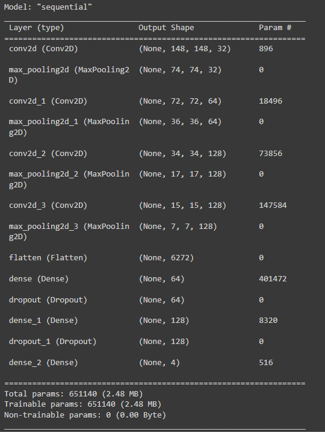

## Overview
This project is a simple example of using Convolutional Neural Network (CNN) in TensorFlow to classify plant disease images on leaves. This model is designed to extract features from images using CNN, then use the CNN output to classify plant diseases. 

## Requirements
- Python 3.x
- numpy
- matplotlib
- seaborn
- scikit-learn
- Jupyter Notebook or Google Colab
- TensorFlow and Keras
- Google Drive (for dataset storage)

## Dataset
The dataset used in this project is a collection of corn images divided into two sets: training set and validation set. This dataset is used to train and evaluate a Convolutional Neural Network (CNN) model that will classify corn images.

### Setup the dataset
1. Download the dataset [here](https://drive.google.com/drive/folders/15yKeItekrKwVgkf4RzT4Yk_THo7ybXiO?usp=drive_link)
2. Click on the folder name "dataset"
3. Clik on Organize > Add Shortcut
4. Choose "My Drive"

## Training
The application uses 6 models. Each model uses 1600 - 3200 training image datasets, 400 - 800 validation image datasets and . Training is carried out for 40 - 60 minutes to complete each model consisting of 100 epochs. This model was trained with the Adam optimizer with learning rate 0.001.

## Model Architecture

## Result
The model has an accuracy of between 94% and 98% shows that the model is able to make predictions with a high level of accuracy. With such accuracy, it can be concluded that the model can correctly classify data over a wide range. However, it is still important to validate the model thoroughly with appropriate testing methods to ensure that its performance can be maintained in various situations and is not affected by overfitting or other factors that may negatively affect its performance.

